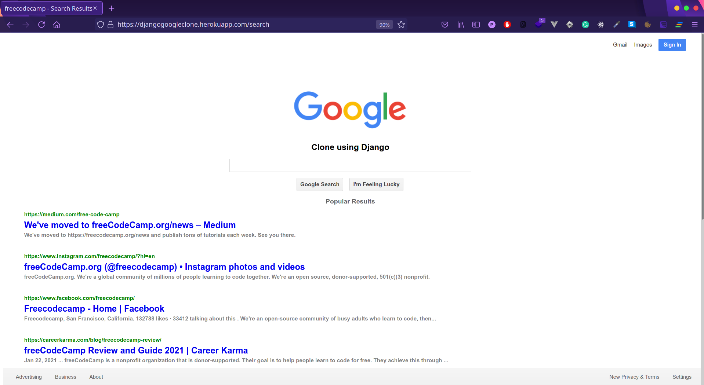
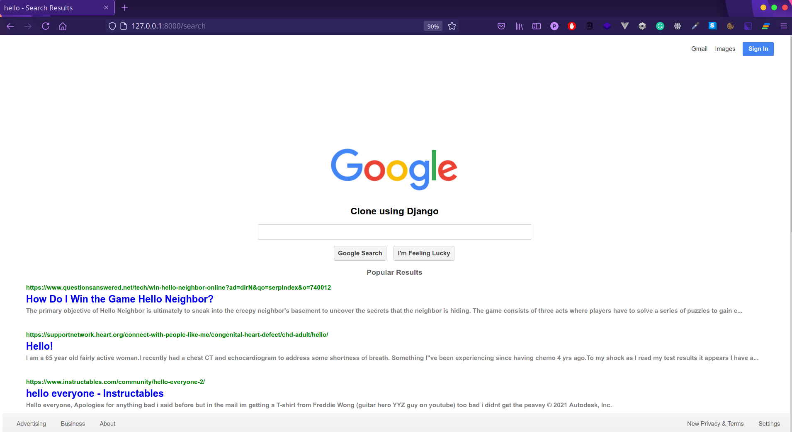

# Google Search Clone using Django

It uses BeautifulSoup to scrape the web for results and display them. All dependencies are listed in requirements.txt file.

You can find the hosted version here [Google Clone](https://djangogoogleclone.herokuapp.com)

